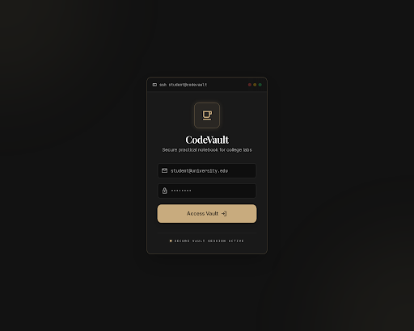
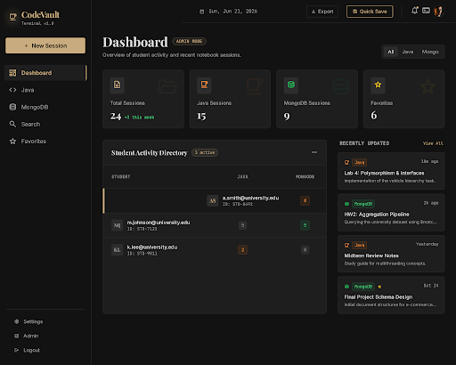
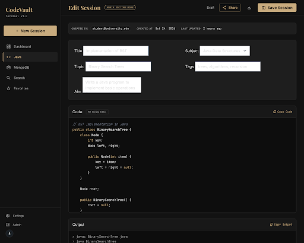
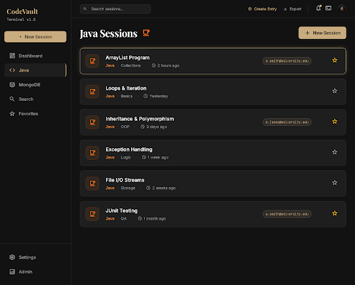
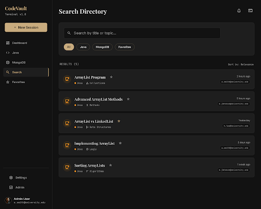

<div align="center">



# ⚡ CodeVault — Lab Notebook

**A premium dark-mode practical notebook for college programming labs**

[](https://github.com/GajjarKashyap/CodeValut)
[](https://react.dev)
[](https://supabase.com)
[](https://vitejs.dev)
[](https://tailwindcss.com)

> **In Beta Phase — Progress is safe but app changes every day.**
> *Dev: Kashyap Gajjar*

</div>

---

## 📸 Screenshots

<table>
  <tr>
    <td></td>
    <td></td>
  </tr>
  <tr>
    <td align="center"><b>Admin Dashboard</b> — Student Activity Directory</td>
    <td align="center"><b>Session Editor</b> — Monaco + Simple editor toggle</td>
  </tr>
  <tr>
    <td></td>
    <td></td>
  </tr>
  <tr>
    <td align="center"><b>Java Sessions</b> — Cards with tags & favorites</td>
    <td align="center"><b>Search</b> — Real-time with filter chips</td>
  </tr>
</table>

---

## ✨ Features

### 📝 Core
- **Session Management** — Create, edit, archive, and restore lab sessions
- **Subject Filtering** — Separate views for Java and MongoDB practicals
- **Favorites** — Star important sessions for quick access
- **Archive** — Soft-delete sessions, restore or permanently delete later

### 💻 Code Editor
- **Monaco Editor** — Full VS Code-style editor with Java/JS syntax highlighting
- **Simple Editor** — Lightweight textarea fallback, perfect for mobile or low-resource devices
- **Tab Indentation** — Tab key inserts 4 spaces in simple mode
- **Ctrl+S** — Save session with keyboard shortcut from anywhere

### 🔍 Search & Discovery
- **Real-time Search** — Debounced live search by title and topic
- **Filter Chips** — Quick filter by All / Java / MongoDB / Favorites
- **Tag System** — Add comma-separated tags to any session, visible in all views

### 📤 Share & Export
- **Share to Web** — Toggle public sharing; anyone with the link can view the session (no login required)
- **Download TXT** — Export session as a plain text file
- **Copy Buttons** — Copy code, output, or notes to clipboard with one click

### 🛡️ Admin Mode (`2072@admin.com`)
- **See all students' sessions** across the entire platform
- **Student Activity Directory** — Table with Java/MongoDB/Total counts per student
- **Click-to-filter** — Click any student row to filter sessions by that student
- **Email badges** — Every session card shows the owner's email when in admin mode

### 🎨 Design
- **Premium dark theme** — Gold (`#c8ab7e`) accent on near-black terminal background
- **Glassmorphism** on Login card
- **Micro-animations** — Hover states, fadeIn, scale transforms
- **Responsive** — Desktop sidebar + mobile bottom navigation
- **Custom scrollbar** — Gold-tinted on hover

---

## 🏗️ Tech Stack

| Layer | Technology |
|-------|-----------|
| Frontend Framework | React 19 + Vite 8 |
| Routing | React Router v7 (HashRouter for GitHub Pages) |
| Styling | Tailwind CSS v4 + Custom Design Tokens |
| Code Editor | Monaco Editor (`@monaco-editor/react`) |
| Backend / Database | Supabase (PostgreSQL + Auth + RLS) |
| Date Formatting | `date-fns` |
| Icons | `lucide-react` |
| Deployment | GitHub Pages (static) |

---

## 🗄️ Database Schema

```sql
-- sessions table
CREATE TABLE sessions (
  id          UUID DEFAULT gen_random_uuid() PRIMARY KEY,
  user_id     UUID REFERENCES auth.users(id),
  user_email  TEXT,
  title       TEXT,
  subject     TEXT,           -- 'Java' | 'MongoDB'
  topic       TEXT,
  aim         TEXT,
  code        TEXT,
  output      TEXT,
  notes       TEXT,
  tags        TEXT[],
  is_favorite BOOLEAN DEFAULT false,
  is_shared   BOOLEAN DEFAULT false,
  is_archived BOOLEAN DEFAULT false,
  share_id    UUID DEFAULT gen_random_uuid(),
  created_at  TIMESTAMPTZ DEFAULT now(),
  updated_at  TIMESTAMPTZ DEFAULT now()
);

-- Row Level Security
ALTER TABLE sessions ENABLE ROW LEVEL SECURITY;

-- Students see only their own sessions
CREATE POLICY "Users manage own sessions"
ON sessions FOR ALL USING (auth.uid() = user_id);

-- Shared sessions are publicly readable (no auth needed)
CREATE POLICY "Shared sessions readable by anyone"
ON sessions FOR SELECT USING (is_shared = true);
```

---

## 🚀 Getting Started

### Prerequisites
- Node.js 18+
- A [Supabase](https://supabase.com) project

### 1. Clone & Install
```bash
git clone https://github.com/GajjarKashyap/CodeValut.git
cd CodeValut
npm install
```

### 2. Configure Environment
Create `.env.local` in the project root:
```env
VITE_SUPABASE_URL=your_supabase_project_url
VITE_SUPABASE_ANON_KEY=your_supabase_anon_key
```

### 3. Set Up Database
Run the SQL from the **Database Schema** section above in your Supabase SQL editor.

### 4. Create Admin Account
Register `2072@admin.com` in Supabase Auth → Users (or via the login page), then set the password to your preference.

### 5. Run Locally
```bash
npm run dev
```

### 6. Deploy to GitHub Pages
```bash
npm run build
# Push the dist/ folder or use GitHub Actions
```

---

## 📁 Project Structure

```
src/
├── components/
│   └── Layout.jsx          # Sidebar + topbar + mobile nav + beta notice
├── contexts/
│   └── AuthContext.jsx     # Supabase auth state
├── lib/
│   └── supabase.js         # Supabase client
├── pages/
│   ├── Login.jsx           # Terminal-themed login
│   ├── Dashboard.jsx       # Stats + recent sessions + admin directory
│   ├── SessionForm.jsx     # Create/edit sessions with Monaco editor
│   ├── SessionList.jsx     # Java / MongoDB / Favorites filtered lists
│   ├── Search.jsx          # Real-time search with filter chips
│   ├── Share.jsx           # Public share view (no auth required)
│   └── Archive.jsx         # Archived sessions with restore/delete
└── index.css               # Global styles, animations, scrollbar
```

---

## 🔐 Admin Access

| Credential | Value |
|-----------|-------|
| Email | `2072@admin.com` |
| Capabilities | View all sessions, Student Activity Directory, email badges |

> Admin access is controlled entirely by email match on the frontend + Supabase RLS policies. The admin can view all students' sessions but cannot delete or modify students' data (by design).

---

## 🗺️ Roadmap

- [ ] PDF export of sessions
- [ ] Session statistics / progress charts
- [ ] Dark/light mode toggle
- [ ] Rich text notes (Markdown preview)
- [ ] Batch export (ZIP of all sessions as TXT)
- [ ] Teacher comments on shared sessions
- [ ] Offline PWA support

---

## 👨‍💻 Developer

<div align="center">

**Kashyap Gajjar**

*Sole developer and designer of CodeVault*

[](https://github.com/GajjarKashyap)

</div>

---

<div align="center">

**⚡ In Beta Phase — Progress is safe but app changes every day.**

*Built with passion for students who deserve better than paper lab notebooks.*

</div>
