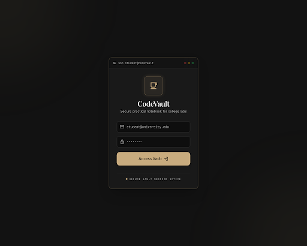
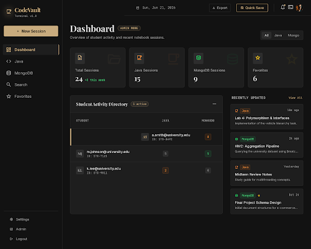
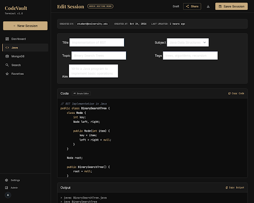
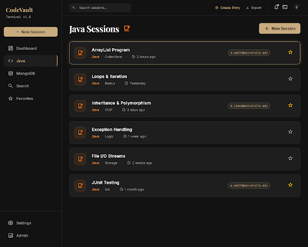
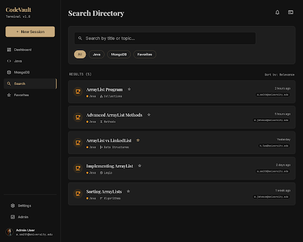

<div align="center">



# ⚡ CodeVault — Lab Notebook & Dev Ecosystem

**A classroom-focused code notebook for creating, organizing, sharing, downloading, and discussing programming practicals across web and mobile.**

[](https://github.com/GajjarKashyap/CodeValut)
[](https://react.dev)
[](https://supabase.com)
[](https://vitejs.dev)
[](https://capacitorjs.com)
[](https://tailwindcss.com)
[](https://github.com/GajjarKashyap/CodeValut/actions/workflows/android.yml)

[Features](#4-feature-highlights) • [Screenshots](#3-screenshots) • [How It Works](#5-how-it-works) • [Architecture](#7-architecture-overview) • [Getting Started](#9-getting-started) • [Contributing](#17-contributing)

---

### 🔥 **ANNOUNCEMENT: We soon Drop Something Big** 🔥
> *Stay tuned! We are currently engineering groundbreaking next-generation updates and massive platform enhancements that will revolutionize how students write, store, collaborate, and execute code in computer science labs. Watch this repository closely!*

</div>

---

## 📖 Table of Contents
1. [Hero Section & Overview](#-codevault--lab-notebook--dev-ecosystem)
2. [Product Overview](#2-product-overview)
3. [Screenshots](#3-screenshots)
4. [Feature Highlights](#4-feature-highlights)
   - [Code and Session Management](#code-and-session-management)
   - [Sharing and Export](#sharing-and-export)
   - [Classroom Collaboration](#classroom-collaboration)
   - [Search and Organization](#search-and-organization)
   - [Readability and Personalization](#readability-and-personalization)
   - [Reliability and Platform Support](#reliability-and-platform-support)
5. [How It Works](#5-how-it-works)
6. [Technology Stack](#6-technology-stack)
7. [Architecture Overview](#7-architecture-overview)
8. [Project Structure](#8-project-structure)
9. [Getting Started](#9-getting-started)
   - [Prerequisites & Installation](#prerequisites)
   - [Environment & Supabase Setup](#environment-configuration)
   - [Development & Deployment](#development)
10. [Mobile and Capacitor Support](#10-mobile-and-capacitor-support)
11. [Available Scripts](#11-available-scripts)
12. [Routes and Main Screens](#12-routes-and-main-screens)
13. [Data and Security Model](#13-data-and-security-model)
14. [Configuration and Local Preferences](#14-configuration-and-local-preferences)
15. [Deployment](#15-deployment)
16. [Roadmap](#16-roadmap)
17. [Contributing](#17-contributing)
18. [Troubleshooting](#18-troubleshooting)
19. [License](#19-license)
20. [Author and Acknowledgements](#20-author-and-acknowledgements)

---

## 2. Product Overview

For decades, university Computer Science and Information Technology programming laboratories have suffered from an archaic, friction-heavy workflow:
- **The Paper & Word Document Trap:** Students are frequently forced to write or paste hundreds of lines of code into MS Word files or physical lab journals where syntax highlighting is non-existent, formatting breaks, and code cannot be easily executed or searched.
- **Fragmented Storage Across Flash Drives:** Weekly practical assignments end up scattered across messy desktop directories, USB flash drives, or untracked WhatsApp study groups.
- **Lack of Instant Peer & Admin Verification:** When a student faces a syntax bug or wants to verify logic with a classmate or lab professor, they lack a fast, real-time channel to share exact code payloads without losing indentation.

### **The CodeVault Solution**
CodeVault (*repository name: `CodeValut`*) was conceived and built from scratch as a **next-generation cloud practical notebook and collaboration ecosystem** tailored specifically to solve these pain points:
- **Centralized Cloud Vault:** Every lab practical (`Java` & `MongoDB`) is instantly saved in PostgreSQL, tagged by subject and topic, and accessible anywhere.
- **True IDE Experience:** Embedded **Monaco Editor** provides real-time syntax checking, automatic bracket matching, and clean code formatting right inside the browser.
- **Effortless Sharing & Export:** Students can share code payloads inside **real-time chat rooms**, invite peers across lab benches via **instant QR codes**, or download exact language-specific source files (`.java`, `.js`/`.json`) in one click.
- **Classroom Admin Verification:** Professors or lab administrators (`admin@admin.com`) can inspect student activity, monitor progress across subjects, moderate profiles, and broadcast instant classroom announcements.

---

## 3. Screenshots

<table width="100%">
  <tr>
    <td width="50%" align="center">
      
      <br />
      <b>Dashboard Console</b><br />
      <sub>Live statistics, quick-access practical cards, and instant classroom announcements</sub>
    </td>
    <td width="50%" align="center">
      
      <br />
      <b>Monaco IDE Editor</b><br />
      <sub>VS Code syntax highlighting + simple lightweight toggle mode for mobile viewports</sub>
    </td>
  </tr>
  <tr>
    <td width="50%" align="center">
      
      <br />
      <b>Practical Sessions</b><br />
      <sub>Subject-filtered cards (`Java` / `MongoDB`) with topic tags, favorites & copy tools</sub>
    </td>
    <td width="50%" align="center">
      
      <br />
      <b>Real-time Search & Filter</b><br />
      <sub>Instant live filtering by keywords across aims, code, topics, and custom tags</sub>
    </td>
  </tr>
</table>

---

## 4. Feature Highlights

### Code and Session Management
- **Structured Practical Workspaces:** Dedicated fields for Session Title, Subject (`Java` vs `MongoDB`), Topic name, Lab Aim, Code payload, Terminal Output, execution Notes, and custom array Tags.
- **Monaco & Lightweight Editing Modes:** Embedded `@monaco-editor/react` engine providing rich syntax highlighting and bracket matching. If on a low-end phone or slow network, users can toggle to **Simple Editor Mode** (`<textarea>`) featuring custom <kbd>Tab</kbd> key 4-space indentation.
- **Instant Save & Organization:** Global keyboard shortcut interceptor (<kbd>Ctrl</kbd>+<kbd>S</kbd> or <kbd>Cmd</kbd>+<kbd>S</kbd>) saves code directly from any field. Includes one-click starring (`is_favorite`) and soft-delete archiving (`Archive.jsx`) with instant restore capabilities.

### Sharing and Export
- **Public & Unlisted Snippet Links:** Generate unique read-only shareable URLs (`#/share/:shareId`) for external review.
- **QR-Code Classroom Sharing:** Client-side QR generation (`qrcode.react`) inside `ShareModal.jsx` allows classmates across lab benches to scan and open snippets directly on their mobile phones. Includes built-in QR scanning/image upload (`jsQR`) to join chat study rooms locally.
- **One-Click Source File Download:** Download practical code directly as clean language-specific source files (`downloadCodeFile.js`) automatically sanitized to `.java`, `.js`, `.json`, `.py`, or `.sql`.
- **Social & Native Sharing:** Integrated one-click share buttons for **WhatsApp** and **Telegram**, plus integration with the mobile **Web Share API** (`navigator.share`).
- **Universal CodeToolbar:** Embedded above every snippet box across session forms, shared views, and chat messages for one-click clipboard copying (`navigator.clipboard.writeText`) with visual checkmark feedback.

### Classroom Collaboration
- **Interactive Chat Hub:** Centralized `ChatDashboard.jsx` directory listing group study rooms, 1-on-1 Direct Messages, and global broadcast channels with explicit quick-delete trash tools.
- **Real-Time Group Rooms:** Powered by Supabase Realtime WebSockets (`supabase.channel()`), broadcasting new chat messages instantly without page polling.
- **Syntax-Highlighted Code Messages:** Attach live code snippets directly inside chat bubbles using the integrated `CodeToolbar` so syntax never loses indentation during discussions.
- **Reactions & Batch Management:** Real-time emoji reactions (`reactions` JSONB column) and multi-selection checkboxes (`isSelectionMode`) for batch deleting personal messages or unlinking group rooms.

### Search and Organization
- **Live Instant Search:** Query practicals in real-time (`Search.jsx`) across titles, aims, topics, notes, and custom tags.
- **Subject Navigation Chips:** One-click filtering between `Java` sessions, `MongoDB` queries, `Favorites`, and `Archived` submissions.
- **Student Activity Directory (Admin Console):** When authenticated with lab admin credentials (`admin@admin.com`), the dashboard reveals a directory of registered students with aggregated session counts (`java_count`, `mongodb_count`, `total_sessions`) and one-click filtering by student ID.

### Readability and Personalization
- **Persistent Code Font Zooming:** Custom `useCodeFontSize` hook supporting persistent zoom sizes (`10px` to `24px`) via UI `<button>` controls and custom browser events, persisted across pages via `localStorage`.
- **Theme & Avatar Customization:** Dedicated `Settings.jsx` screen for updating profile display names, uploading custom avatars to Supabase Storage (`avatars` bucket), and switching color themes (`theme-gold`, `theme-blue`, `theme-emerald`, `theme-pearl`).
- **Responsive Layout:** Engineered with Tailwind CSS for seamless scaling across wide desktop monitors, tablet viewports (`tablet mode` flag), and mobile devices.

### Reliability and Platform Support
- **Application Crash Shield (`ErrorBoundary` & `ServerError`):** Top-level React error boundary catching unexpected rendering exceptions. Features a **Copy Error Log** button (`handleCopyError`) formatted with exact timestamps and stack traces, plus a one-click **Restart & Clear Cache** recovery button.
- **Dedicated Error Suite:** Custom developer-themed views for `404 Not Found` (featuring an interactive in-page vault search box), `403 Forbidden` (security lock diagnostics), `500 Server Error`, and `NetworkError` (`/offline` view with live Supabase endpoint pinging).
- **Automated Boot-Time Version Checker:** The `<VersionChecker>` component checks `public/version.json` against hardcoded `CURRENT_VERSION = '1.3.5'`, notifying students when new releases drop or blocking with a mandatory alert when `min_version` security patches are required.
- **Static Web & Native Android Ecosystem:** Built with `HashRouter` (`#/...`) for 100% compatibility with GitHub Pages static hosting, and wrapped inside a native Android shell (`mobile-app/`) powered by **Capacitor 8** with haptic vibration, keyboard handling, and system notifications.

---

## 5. How It Works

```text
 ┌───────────────┐     ┌──────────────────┐     ┌──────────────────┐
 │ 1. Authenticate│ ──► │ 2. Create Session│ ──► │ 3. Format & Code │
 │ (Supabase Auth)│     │  (Java/MongoDB)  │     │ (Monaco Editor)  │
 └───────────────┘     └──────────────────┘     └────────┬─────────┘
                                                         │
 ┌───────────────┐     ┌──────────────────┐     ┌────────▼─────────┘
 │ 6. Mobile Lab │ ◄── │ 5. Collaborate   │ ◄── │ 4. Save & Share  │
 │ (Android APK) │     │ (Chat & QR Code) │     │ (PostgreSQL RLS) │
 └───────────────┘     └──────────────────┘     └──────────────────┘
```

1. **Sign In & Authenticate:** Log in securely using your student email via Supabase Authentication (`Login.jsx`).
2. **Create a Practical Session:** Select your lab subject (`Java` or `MongoDB`), input the lab aim, and type your syntax inside the Monaco Editor (`SessionForm.jsx`).
3. **Format & Document:** Add terminal output, notes, topic names, and custom tags. Press <kbd>Ctrl</kbd>+<kbd>S</kbd> to save instantly to cloud PostgreSQL.
4. **Organize & Favorite:** Star critical sessions for exam preparation or archive completed semester submissions.
5. **Share with Classmates:** Click **Share** inside any session to generate a scannable QR code, send a WhatsApp/Telegram link, or download the code as a clean `.java` / `.json` file.
6. **Collaborate in Classroom Chat:** Join group study rooms (`ChatRoom.jsx`), attach live syntax-highlighted code blocks directly to chat bubbles, and react with real-time emojis.
7. **Access on Mobile:** Open CodeVault from any mobile browser or via our native Android APK (`CODEVAULT.apk`) for revision anywhere.

---

## 6. Technology Stack

| Area | Technology | Purpose & Verified Role |
| :--- | :--- | :--- |
| **UI Framework** | React `19.2.6` | Component-based modern frontend architecture (`react`, `react-dom`) |
| **Build & Tooling** | Vite `8.0.12` | Lightning-fast development server and optimized static production bundler |
| **Client Routing** | React Router `7.18.0` | Hash-based client routing (`#/...`) optimized for static web hosts and native WebView |
| **Backend & Auth** | Supabase (`@supabase/supabase-js` `2.108.2`) | Cloud PostgreSQL database, Row-Level Security, Auth JWTs, Storage, and Realtime WebSockets |
| **Styling Engine** | Tailwind CSS `3.4.19` | Utility-first responsive dark-mode styling (*Note: Verified `v3.4.19`, not v4*) |
| **Code Editor** | Monaco Editor (`@monaco-editor/react` `4.7.0`) | VS Code syntax highlighting, bracket matching, and code formatting |
| **Native Mobile** | Capacitor `8.x` (`@capacitor/core`, `@capacitor/app`) | Native Android WebView shell, haptics, keyboard handling, and local system notifications |
| **QR Code Engine** | qrcode.react `4.2.0` | Client-side SVG QR code generation for instant classroom snippet sharing |
| **Iconography** | Lucide React `1.21.0` | Consistent, lightweight developer interface icons |
| **Date Formatting** | date-fns `4.4.0` | Human-readable relative timestamps (`formatDistanceToNow`) across cards and messages |

---

## 7. Architecture Overview

CodeVault operates as a decoupled React single-page application (SPA) communicating directly with a Supabase Backend-as-a-Service over HTTPS PostgREST APIs and Realtime WebSockets (`pg_notify`).

```text
React 19 & Vite 8 Frontend (Client Bundle / Android WebView)
   │
   ├── <ErrorBoundary> (Global Fatal Exception Shield & Stack Trace Copier)
   ├── <AuthProvider> (Supabase Auth Session Tracker & Heartbeat Sync)
   ├── <Router> (HashRouter: #/...)
   │      ├── Protected Routes (<Layout>, Dashboard, SessionForm, SessionList, ChatRoom, Settings)
   │      └── Public & Error Routes (Login, /share/:shareId, /download, /404, /403, /500, /offline)
   │
   ├── <VersionChecker> (Compares public/version.json against CURRENT_VERSION = '1.3.5')
   │
   └── Supabase Client (@supabase/supabase-js)
          ├── Authentication (auth.users & JWT Bearer tokens)
          ├── PostgreSQL Database (sessions, profiles, user_activity, groups, group_messages, notifications)
          ├── Row-Level Security (RLS kernel policies checking auth.uid())
          └── Realtime WebSockets (pg_notify channels for live group messages & push alerts)
```

### Architectural Principles
- **Hash Routing Compatibility (`HashRouter`):** Because CodeVault is hosted on GitHub Pages (`gh-pages`) and wrapped inside a local Android filesystem WebView, standard HTML5 pushState routing would trigger `404` errors upon deep linking. `HashRouter` (`#/...`) ensures exact path resolution across all environments without server-side rewrite rules.
- **Bulletproof Single-Record Queries (`.maybeSingle()`):** In PostgREST, `.single()` throws an explicit `HTTP 406 Not Acceptable` error if a query returns zero rows (`e.g., checking empty memberships or DMs`). All CodeVault data lookups are engineered with `.limit(1).maybeSingle()`, cleanly returning `data: null` on empty results with zero console crashes.
- **Heartbeat & Activity Sync:** Whenever `AuthContext` detects a logged-in session, it executes `updateUserActivity()` to update the student's heartbeat (`user_activity` table) with their latest username, email, and `last_active` timestamp, keeping the admin directory synchronized in real-time.

---

## 8. Project Structure

```text
CodeValut/
├── .github/
│   └── workflows/
│       └── android.yml            # CI workflow for compiling debug APKs automatically on main branch
├── mobile-app/                    # Capacitor Android native project shell
│   ├── android/                   # Native Android studio project directory and Gradle scripts
│   ├── builder.js                 # Helper script for synchronizing web assets into native folders
│   ├── capacitor.config.json      # Capacitor app configuration (com.codevault.app)
│   └── package.json               # Mobile-specific dependencies and build scripts
├── public/
│   ├── APP/
│   │   ├── CODEVAULT.apk          # Precompiled downloadable Android APK binary
│   │   └── app-debug.apk          # Latest debug APK generated via CI build artifact
│   ├── screenshots/               # Verified UI screenshots (dashboard, session_editor, search, etc.)
│   ├── favicon.svg                # Project SVG icon
│   └── version.json               # Remote version manifest read by <VersionChecker> on boot
├── src/
│   ├── components/
│   │   ├── code/
│   │   │   └── CodeToolbar.jsx    # Snippet toolbar with language badge, copy tool, and download triggers
│   │   ├── share/
│   │   │   └── ShareModal.jsx     # QR code generation and WhatsApp/Telegram/Native social sharing modal
│   │   ├── ErrorBoundary.jsx      # Top-level React exception catcher rendering ServerError
│   │   └── Layout.jsx             # Persistent navigation sidebar, header bell, and mobile bottom navigation
│   ├── constants/
│   │   └── languageExtensions.js  # Mapping of programming languages to file extensions (.java, .js, etc.)
│   ├── contexts/
│   │   └── AuthContext.jsx        # Global Supabase authentication state and activity tracker
│   ├── hooks/
│   │   └── useCodeFontSize.js     # Custom hook managing persisted A-/A+ code font zoom across components
│   ├── lib/
│   │   └── supabase.js            # Supabase API client initialization using environment variables
│   ├── pages/
│   │   ├── Archive.jsx            # Soft-deleted practical sessions restoration page
│   │   ├── ChatDashboard.jsx      # Classroom groups, direct messages, and bulk selection interface
│   │   ├── ChatRoom.jsx           # Real-time WebSocket chat room with code embedding and QR invites
│   │   ├── Dashboard.jsx          # Student dashboard & Admin directory console (announcements/moderation)
│   │   ├── DownloadApp.jsx        # Landing page for direct Android APK downloads (/download)
│   │   ├── Forbidden.jsx          # 403 Access Denied error screen with terminal diagnostic styling
│   │   ├── Login.jsx              # Student authentication portal with sign-up and sign-in tabs
│   │   ├── NetworkError.jsx       # Offline recovery view with live Supabase endpoint connection monitor
│   │   ├── NotFound.jsx           # 404 Error screen with integrated in-page vault search box
│   │   ├── Search.jsx             # Real-time filtering page with subject, topic, and tag chips
│   │   ├── ServerError.jsx        # 500 Crash recovery screen with one-click stack trace copier
│   │   ├── SessionForm.jsx        # Monaco & simple IDE editor for creating/editing practicals
│   │   ├── SessionList.jsx        # Subject/favorite/shared cards list with formatDistanceToNow timestamps
│   │   ├── Settings.jsx           # Profile customization, avatar upload (`avatars` bucket), and theme selector
│   │   └── Share.jsx              # Public read-only viewer for shared code snippets (/share/:shareId)
│   ├── utils/
│   │   ├── downloadCodeFile.js    # Browser Blob creation for downloading source code files
│   │   └── shareUtils.js          # Helpers generating WhatsApp, Telegram, and QR server URLs
│   ├── App.css                    # Global application styles and animations
│   ├── App.jsx                    # Root router, protected route wrapper, and version checker overlay
│   ├── index.css                  # Tailwind CSS directives, theme variables, and custom scrollbars
│   └── main.jsx                   # React 19 DOM entry point
├── package.json                   # Root dependencies, project metadata, and npm scripts
├── tailwind.config.js             # Tailwind CSS utility configuration and theme extensions
└── vite.config.js                 # Vite bundler configuration with repository base path (/CodeValut/)
```

---

## 9. Getting Started

### Prerequisites
- **Node.js:** `v18.0.0` or higher (recommended: `v20+` or `v22+` compatible with Vite 8 and React 19).
- **npm:** `v9.0.0` or higher.
- **Supabase Project:** A free or paid project created at [supabase.com](https://supabase.com).
- **Android Studio & JDK 21 (Optional):** Required only if compiling native Android `.apk` builds locally.

### Installation
Clone the repository and install root dependencies:
```bash
git clone https://github.com/GajjarKashyap/CodeValut.git
cd CodeValut
npm install
```

### Environment Configuration
Create a `.env.local` file inside the root directory (`CodeValut/.env.local`). Vite exposes environment variables to the frontend strictly when prefixed with `VITE_`:
```env
VITE_SUPABASE_URL=your_supabase_project_url
VITE_SUPABASE_ANON_KEY=your_supabase_anon_key
```

### Supabase Configuration
To run CodeVault, your Supabase PostgreSQL instance requires **Authentication (Email Provider)**, a public storage bucket named **`avatars`**, and the core relational tables with Row-Level Security (RLS) enabled.

<details>
<summary><b>Click to view verified Database Schema & RLS Setup SQL</b></summary>

Copy and execute the following master SQL inside your **Supabase SQL Editor**:

```sql
-- 1. Enable UUID extension
CREATE EXTENSION IF NOT EXISTS "uuid-ossp";

-- 2. Sessions table (Stores practical sessions)
CREATE TABLE sessions (
  id          UUID DEFAULT gen_random_uuid() PRIMARY KEY,
  user_id     UUID REFERENCES auth.users(id) ON DELETE CASCADE,
  user_email  TEXT,
  title       TEXT NOT NULL,
  subject     TEXT NOT NULL,          -- 'Java' | 'MongoDB'
  topic       TEXT,
  aim         TEXT,
  code        TEXT,
  output      TEXT,
  notes       TEXT,
  tags        TEXT[] DEFAULT '{}',
  is_favorite BOOLEAN DEFAULT false,
  is_shared   BOOLEAN DEFAULT false,
  is_archived BOOLEAN DEFAULT false,
  share_id    UUID DEFAULT gen_random_uuid(),
  created_at  TIMESTAMPTZ DEFAULT now(),
  updated_at  TIMESTAMPTZ DEFAULT now()
);

-- 3. Profiles table (User metadata)
CREATE TABLE profiles (
  id           UUID PRIMARY KEY REFERENCES auth.users(id) ON DELETE CASCADE,
  username     TEXT UNIQUE,
  display_name TEXT,
  avatar_url   TEXT,
  created_at   TIMESTAMPTZ DEFAULT now(),
  updated_at   TIMESTAMPTZ DEFAULT now()
);

-- 4. User Activity table (Student directory & heartbeat tracking)
CREATE TABLE user_activity (
  user_id     UUID PRIMARY KEY REFERENCES auth.users(id) ON DELETE CASCADE,
  username    TEXT,
  email       TEXT,
  last_active TIMESTAMPTZ DEFAULT now()
);

-- 5. Groups table (Chat rooms & DMs)
CREATE TABLE groups (
  id                UUID DEFAULT gen_random_uuid() PRIMARY KEY,
  name              TEXT NOT NULL,
  is_direct_message BOOLEAN DEFAULT false,
  is_global         BOOLEAN DEFAULT false,
  admin_only        BOOLEAN DEFAULT false,
  created_by        UUID REFERENCES auth.users(id) ON DELETE SET NULL,
  created_at        TIMESTAMPTZ DEFAULT now()
);

-- 6. Group Members table
CREATE TABLE group_members (
  id        UUID DEFAULT gen_random_uuid() PRIMARY KEY,
  group_id  UUID REFERENCES groups(id) ON DELETE CASCADE,
  user_id   UUID REFERENCES auth.users(id) ON DELETE CASCADE,
  role      TEXT DEFAULT 'member',     -- 'admin' | 'member'
  joined_at TIMESTAMPTZ DEFAULT now(),
  UNIQUE(group_id, user_id)
);

-- 7. Group Messages table (Real-time chat & code snippets)
CREATE TABLE group_messages (
  id         UUID DEFAULT gen_random_uuid() PRIMARY KEY,
  group_id   UUID REFERENCES groups(id) ON DELETE CASCADE,
  user_id    UUID REFERENCES auth.users(id) ON DELETE CASCADE,
  content    TEXT NOT NULL,
  snippet    JSONB,                   -- Optional: { "title": "...", "code": "...", "language": "java" }
  reactions  JSONB DEFAULT '{}'::jsonb,
  reply_to   UUID REFERENCES group_messages(id) ON DELETE SET NULL,
  created_at TIMESTAMPTZ DEFAULT now()
);

-- 8. Notifications table (Push alerts)
CREATE TABLE notifications (
  id         UUID DEFAULT gen_random_uuid() PRIMARY KEY,
  user_id    UUID REFERENCES auth.users(id) ON DELETE CASCADE,
  type       TEXT NOT NULL,           -- 'announcement' | 'reply' | 'mention' | 'moderation'
  message    TEXT NOT NULL,
  link       TEXT,
  is_read    BOOLEAN DEFAULT false,
  created_at TIMESTAMPTZ DEFAULT now()
);

-- 9. Audit Logs table (Admin accountability)
CREATE TABLE audit_logs (
  id             UUID DEFAULT gen_random_uuid() PRIMARY KEY,
  admin_id       UUID REFERENCES auth.users(id) ON DELETE SET NULL,
  action         TEXT NOT NULL,
  target_user_id UUID,
  details        TEXT,
  created_at     TIMESTAMPTZ DEFAULT now()
);

-- ==========================================
-- ROW LEVEL SECURITY (RLS) POLICIES
-- ==========================================
ALTER TABLE sessions ENABLE ROW LEVEL SECURITY;
ALTER TABLE profiles ENABLE ROW LEVEL SECURITY;
ALTER TABLE user_activity ENABLE ROW LEVEL SECURITY;
ALTER TABLE groups ENABLE ROW LEVEL SECURITY;
ALTER TABLE group_members ENABLE ROW LEVEL SECURITY;
ALTER TABLE group_messages ENABLE ROW LEVEL SECURITY;
ALTER TABLE notifications ENABLE ROW LEVEL SECURITY;
ALTER TABLE audit_logs ENABLE ROW LEVEL SECURITY;

-- Sessions: Users can CRUD their own, public can read if is_shared=true, admin@admin.com can read all
CREATE POLICY "Users read own sessions" ON sessions FOR SELECT USING (auth.uid() = user_id OR is_shared = true OR auth.jwt() ->> 'email' = 'admin@admin.com');
CREATE POLICY "Users insert own sessions" ON sessions FOR INSERT WITH CHECK (auth.uid() = user_id);
CREATE POLICY "Users update own sessions" ON sessions FOR UPDATE USING (auth.uid() = user_id OR auth.jwt() ->> 'email' = 'admin@admin.com');
CREATE POLICY "Users delete own sessions" ON sessions FOR DELETE USING (auth.uid() = user_id OR auth.jwt() ->> 'email' = 'admin@admin.com');

-- Profiles & User Activity: Public read, owner update
CREATE POLICY "Public read profiles" ON profiles FOR SELECT USING (true);
CREATE POLICY "Users update own profile" ON profiles FOR UPDATE USING (auth.uid() = id);
CREATE POLICY "Public read activity" ON user_activity FOR SELECT USING (true);
CREATE POLICY "Users update own activity" ON user_activity FOR ALL USING (auth.uid() = user_id);

-- Groups & Messages: Members and admins can access
CREATE POLICY "Public read groups" ON groups FOR SELECT USING (true);
CREATE POLICY "Users insert groups" ON groups FOR INSERT WITH CHECK (auth.uid() = created_by);
CREATE POLICY "Admins delete groups" ON groups FOR DELETE USING (auth.uid() = created_by OR auth.jwt() ->> 'email' = 'admin@admin.com');

CREATE POLICY "Public read messages" ON group_messages FOR SELECT USING (true);
CREATE POLICY "Users insert messages" ON group_messages FOR INSERT WITH CHECK (auth.uid() = user_id);
CREATE POLICY "Users delete messages" ON group_messages FOR DELETE USING (auth.uid() = user_id OR auth.jwt() ->> 'email' = 'admin@admin.com');

-- Notifications: User reads own, anyone can insert (for alerts/announcements)
CREATE POLICY "Users read own notifications" ON notifications FOR SELECT USING (auth.uid() = user_id);
CREATE POLICY "Users insert notifications" ON notifications FOR INSERT WITH CHECK (true);
CREATE POLICY "Users update read status" ON notifications FOR UPDATE USING (auth.uid() = user_id);

-- Audit Logs: Admin access only
CREATE POLICY "Admins read audit logs" ON audit_logs FOR SELECT USING (auth.jwt() ->> 'email' = 'admin@admin.com');
CREATE POLICY "Admins insert audit logs" ON audit_logs FOR INSERT WITH CHECK (auth.jwt() ->> 'email' = 'admin@admin.com');
```
</details>

### Development
Start the local Vite Hot-Reload development server:
```bash
npm run dev
```
Open your browser to `http://localhost:5173`.

### Production Build & Preview
Verify clean compilation and preview the static production bundle locally:
```bash
npm run build
npm run preview
```

### GitHub Pages Deployment
Deploy the compiled `dist/` directory directly to GitHub Pages (`gh-pages` branch):
```bash
npm run deploy
```

---

## 10. Mobile and Capacitor Support

CodeVault features native Android integration managed via the `mobile-app/` directory (`Capacitor 8` shell). The web bundle (`dist/`) is wrapped directly inside an Android native WebView (`com.codevault.app`), giving students native device capabilities.

### Installed Native Plugins
- **`@capacitor/app` (`v8.1.0`):** Manages native app state and hardware back-button navigation.
- **`@capacitor/haptics` (`v8.0.2`):** Delivers tactile vibration feedback on interactive buttons and actions.
- **`@capacitor/keyboard` (`v8.0.5`):** Adjusts viewport dimensions cleanly when the Android virtual keyboard opens.
- **`@capacitor/local-notifications` (`v8.2.0`):** Schedules and fires native system status notifications.

### Synchronizing and Building Native Android
Whenever you modify files in the `src/` web directory, synchronize those updates into the native Android shell:
```bash
# 1. Build the root web bundle and install mobile dependencies
npm run build
cd mobile-app
npm install

# 2. Synchronize web assets inside the Android native directory
npx cap sync android

# 3. Open Android Studio to build APK or run on connected device
npx cap open android
```

### Distinguishing Web vs. Native Deliverables
- **Responsive Web Application:** Accessible from any browser (`#/sessions/Java`, `#/chat`).
- **Installed Native App:** Standalone Android application with optional `StickersLockScreen` biometric/PIN security on startup.
- **Download Portal (`/download`):** Dedicated landing page (`DownloadApp.jsx`) where students can download the prebuilt `.apk`.
- **Precompiled Binary Availability:** The compiled APK binary is stored inside the repository at `public/APP/CODEVAULT.apk` (`5.4 MB`) and generated automatically via our GitHub Actions CI workflow (`.github/workflows/android.yml`).

---

## 11. Available Scripts

| Command | Description |
| :--- | :--- |
| `npm run dev` | Starts the Vite local development server (`http://localhost:5173`) with Hot Module Replacement. |
| `npm run build` | Compiles and optimizes the React application into static production assets inside the `dist/` directory. |
| `npm run lint` | Runs ESLint (`eslint .`) across all source files to verify syntax quality and React hook constraints. |
| `npm run preview` | Spins up a local web server (`vite preview`) to inspect the compiled `dist/` bundle before deployment. |
| `npm run predeploy` | Automatically runs `npm run build` right before the GitHub Pages deployment command executes. |
| `npm run deploy` | Pushes the compiled `dist/` folder directly to the `gh-pages` branch on GitHub (`gh-pages -d dist`). |

---

## 12. Routes and Main Screens

| Route Path | Screen / Component | Description |
| :--- | :--- | :--- |
| `/login` | `Login.jsx` | Student authentication portal with sign-in and account registration. |
| `/` | `Dashboard.jsx` | Main console with activity stats, recent practicals, and admin console. |
| `/session/new` | `SessionForm.jsx` | IDE workspace (`Monaco Editor` or `<textarea>`) to create a new practical session. |
| `/session/:id` | `SessionForm.jsx` | IDE workspace loaded with an existing practical for editing or execution notes. |
| `/sessions/:subject` | `SessionList.jsx` | Filtered list of practical cards (`Java` or `MongoDB`) with topic tags. |
| `/favorites` | `SessionList.jsx` | Grid of sessions starred by the student (`is_favorite = true`). |
| `/shared` | `SessionList.jsx` | Practicals marked by the student as publicly shared (`is_shared = true`). |
| `/search` | `Search.jsx` | Real-time search interface filtering by keyword across titles, topics, and code. |
| `/archive` | `Archive.jsx` | Soft-deleted sessions repository with options to restore or permanently delete. |
| `/chat` | `ChatDashboard.jsx` | Classroom messaging directory listing group rooms and direct messages. |
| `/chat/:chatId` | `ChatRoom.jsx` | Real-time WebSocket study room with syntax-highlighted code embedding and QR links. |
| `/share/:shareId` | `Share.jsx` | Public read-only snippet viewer for sharing code links outside the platform. |
| `/settings` | `Settings.jsx` | Profile customization, avatar upload (`avatars` bucket), and theme selector. |
| `/download` | `DownloadApp.jsx` | Dedicated mobile app download portal offering direct access to `CODEVAULT.apk`. |
| `/404`, `/403`, `/500`, `/offline` | `NotFound`, `Forbidden`, `ServerError`, `NetworkError` | Rich developer-themed error handling and crash recovery screens. |

---

## 13. Data and Security Model

CodeVault combines client-side routing guards with server-side database security:
- **Supabase Authentication (`auth.users`):** Handles JWT generation, session persistence, and token refresh automatically across browser tabs and mobile WebViews.
- **Row-Level Security (RLS) Enforcement:** The database tables (`sessions`, `profiles`, `user_activity`, `group_messages`, `notifications`) are secured with RLS policies checking `auth.uid()`. Students can only query, modify, or delete sessions that belong to their unique user ID (`user_id = auth.uid()`) unless the session is explicitly marked as shared (`is_shared = true`).

> [!IMPORTANT]
> **Client-Side Protection vs. Backend Security:** Client-side route guards (`<ProtectedRoute>`) merely prevent unauthenticated UI rendering. They are **not** a substitute for Supabase Row-Level Security. All data authorization rules must be strictly enforced at the PostgreSQL kernel level using RLS policies.

- **Admin Access Behavior:** The frontend inspects the user's email (`admin@admin.com`) to unlock the student activity directory, moderate profile avatars, and broadcast classroom announcements. To guarantee true security, database audit logs and universal read/write capabilities must also be verified inside RLS policies (`auth.jwt() ->> 'email' = 'admin@admin.com'`).

---

## 14. Configuration and Local Preferences

CodeVault uses browser `localStorage` to persist student preferences, UI state, and feature toggles across sessions:

| Storage Key | Type | Purpose & Behavior |
| :--- | :--- | :--- |
| `codevault_code_font_size` | `Number` | Stores the user's preferred code font zoom size (`10` to `24`), synced across all editors. |
| `codevault_skipped_version` | `String` | Records the version string (`e.g., '1.4.0'`) that the user chose to skip when prompted by `<VersionChecker>`. |
| `codevault_last_active_route` | `String` | Tracks the last visited route for session restoration or clearing during crash recovery. |
| `codevault_theme` | `String` | Persists the selected color theme (`theme-gold`, `theme-blue`, `theme-emerald`, `theme-pearl`). |
| `codevault_flag_enable_haptics` | `Boolean` | Feature flag toggling Capacitor device vibration on interactive buttons (`true` by default). |
| `codevault_flag_enable_update_checker`| `Boolean` | Feature flag enabling boot-time remote version check against `public/version.json` (`true` by default). |
| `codevault_flag_enable_tablet_mode` | `Boolean` | Feature flag enabling expanded responsive layout scaling for tablet viewports (`true` by default). |

---

## 15. Deployment

CodeVault is configured for zero-friction static deployment on **GitHub Pages**:
- **Static Bundling & Base Path:** The Vite bundler (`vite.config.js`) compiles static assets with `base: '/CodeValut/'` corresponding to the repository subdirectory. Combined with `HashRouter` (`#/...`) in `App.jsx`, this prevents `404 Not Found` routing errors when users bookmark deep links on GitHub Pages.
- **Build-Time Environment Injection:** Vite embeds variables (`VITE_SUPABASE_URL`, `VITE_SUPABASE_ANON_KEY`) directly into the JavaScript client bundle during `npm run build`. Ensure these environment variables are populated before triggering production builds.
- **Application Update Check Mechanism:** On startup, `<VersionChecker>` fetches `public/version.json` over HTTP (`?t=timestamp` to bypass CDN caching) and compares semantic versions against `CURRENT_VERSION = '1.3.5'` defined in `App.jsx`, alerting students right inside the interface when new features or security patches drop.

---

## 16. Roadmap

- [ ] **Real-Time Multi-Cursor Collaboration:** Enable simultaneous live peer typing inside the Monaco Editor during active classroom chat study sessions.
- [ ] **Offline-First Data Caching:** Integrate local SQLite caching inside the Capacitor mobile shell so students can draft and edit practical sessions without an active internet connection.
- [ ] **Automated Code Evaluation:** Build lightweight syntax validation and unit test assertion runners to assist lab professors in automated grading.
- [ ] **Journal PDF Export:** Add one-click export to compile an entire subject's practical sessions (`Java` or `MongoDB`) into a cleanly formatted, printable PDF lab journal.

---

## 17. Contributing

We welcome contributions from students, educators, and open-source developers!

1. **Fork the Repository:** Click the **Fork** button at the top right of the GitHub page.
2. **Clone your Fork:**
   ```bash
   git clone https://github.com/YourUsername/CodeValut.git
   cd CodeValut
   ```
3. **Create a Feature Branch:**
   ```bash
   git checkout -b feature/awesome-improvement
   ```
4. **Make Focused Changes:** Ensure code quality and adherence to existing component patterns.
5. **Lint and Build:** Verify clean compilation locally:
   ```bash
   npm run lint
   npm run build
   ```
6. **Commit & Push:**
   ```bash
   git commit -m "feat: add support for syntax highlighting in Python"
   git push origin feature/awesome-improvement
   ```
7. **Open a Pull Request:** Submit your PR against the `main` branch with a concise summary of your additions.

> [!CAUTION]
> **Never commit real credentials:** Do not include `.env.local` files, private Supabase service role keys, or sensitive API secrets in any git commits or pull requests.

---

## 18. Troubleshooting

- **Blank Screen or Database Connection Errors on Startup:**
  Check that `VITE_SUPABASE_URL` and `VITE_SUPABASE_ANON_KEY` are properly defined in `.env.local` and restart the Vite development server (`npm run dev`).
- **`Permission Denied` or Empty Results on Sessions/Chats:**
  Verify that Row-Level Security (RLS) policies are active on your Supabase tables. Ensure your queries use `.limit(1).maybeSingle()` instead of `.single()` when querying individual records to prevent `HTTP 406 Not Acceptable` errors.
- **Deep Links Throwing `404` on GitHub Pages:**
  Confirm that `vite.config.js` specifies `base: '/CodeValut/'` and that you are navigating using `HashRouter` paths (`https://gajjarkashyap.github.io/CodeValut/#/sessions/Java`).
- **Monaco Editor Hanging on Slow or Offline Networks:**
  If the `@monaco-editor/react` CDN bundle hangs on slow mobile connections, click the **Simple Editor Mode** toggle inside `SessionForm.jsx` to switch instantly to our lightweight `<textarea>` editor.
- **Capacitor Android Sync Not Updating Native APK:**
  Always execute `npm run build` inside the root or `mobile-app/` directory before running `npx cap sync android` so the native WebView receives the latest compiled web assets.
- **Clipboard (`Copy`) or Social (`Share`) Buttons Not Responding:**
  `navigator.clipboard` and `navigator.share` require secure browser contexts. Ensure you are running locally on `http://localhost` or over a verified HTTPS domain.

---

## 19. License

No `LICENSE` file is currently included in the repository root or subdirectories. All rights belong to the author. For educational, academic lab, or commercial usage inquiries, please contact the maintainer directly or open an issue.

---

## 20. Author and Acknowledgements

<div align="center">

**Lead Architect & Creator:** [Kashyap Gajjar](https://github.com/GajjarKashyap)

Built with love using [React 19](https://react.dev/), [Vite 8](https://vitejs.dev/), [Supabase](https://supabase.com/), [Tailwind CSS](https://tailwindcss.com/), [Monaco Editor](https://microsoft.github.io/monaco-editor/), and [Capacitor](https://capacitorjs.com/).

---

*Remember: We soon Drop Something Big! Watch this repository closely.*

</div>
